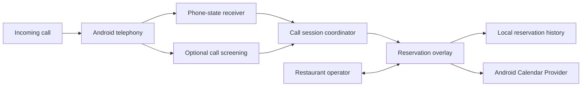

# Restaurant Call Assistant

An Android reservation helper that opens a floating form during incoming calls, pre-fills caller details, and creates calendar events without leaving the call.


## Overview

The app is designed for restaurant staff taking reservations over ordinary Android phone calls. When an eligible call comes in, it opens a draggable overlay above the dialer so the operator can enter the customer's reservation details while continuing the conversation.

The application observes Android phone-state events, reduces duplicate or partial caller notifications into one call session, optionally resolves the caller through Contacts, and stores reservation history locally. Confirmed reservations can be inserted directly into the device calendar, with a pre-filled calendar editor used as a fallback.

## Call flow




The phone call itself remains in Android's normal dialer.

## What it handles

- Detects incoming call state through Android phone-state broadcasts
- Uses an optional `CallScreeningService` as a second source of caller information
- Opens a minimized foreground overlay for eligible calls
- Looks up caller names from the Android Contacts Provider
- Captures reservation time, party size, duration, preferences, event type, and notes
- Saves unfinished reservations as local drafts
- Inserts confirmed reservations into device calendar
- Stores local reservation history and calendar creation status

## Engineering details

### Call-session reduction

Android can surface the same incoming call through multiple callbacks, and the first phone-state broadcast may not include the caller number.

`IncomingCallSession` reduces those events into one process-local call session. Duplicate numbered events are suppressed, while a later known number can update a session that originally arrived as unknown.

The receiver also waits briefly for a companion broadcast before treating a missing number as an unknown caller.

### Waiting-call handling

The app can retain a second ringing caller while another call is active.

When the call state changes, the coordinator checks recent Call Log entries off the main thread before replacing the caller shown in the overlay. If the app cannot confirm what happened to the second call, it keeps the existing caller information rather than replacing it speculatively.

### Reservation overlay

`ReservationOverlayService` runs as a foreground service and creates a movable `WindowManager` overlay above other apps.

The overlay starts minimized and can be expanded into the reservation form. Caller details can be filled automatically, while session-aware updates avoid overwriting fields the operator has already edited.

The overlay has its own lifecycle and can remain open after the phone call ends so unfinished reservation details are not immediately discarded.

### Calendar creation and fallback

`CalendarRepository` queries Google-account calendars exposed through Android's Calendar Provider.

When direct insertion is available, the app creates the reservation event and stores the returned event ID in local history. If direct insertion is unavailable or fails, it opens a pre-filled calendar event editor so the operator can complete the action manually.

Local history distinguishes between a created event, a saved draft, a failed attempt, and an event editor that was opened but not confirmed.

## Data and integrations

```text
Android Telephony
      |
      v
IncomingCallCoordinator
      |
      v
ReservationOverlayService
   /       |        \
Contacts   |       Calendar Provider
           |
     SharedPreferences
```

Application state is split between:

- in-memory call and overlay state
- app-private `SharedPreferences` for reservations, settings, and ignored numbers
- Android Contacts, Call Log, and Calendar Providers

## Tech stack

| Area | Technology |
| --- | --- |
| Language | Kotlin |
| Platform | Android |
| Main UI | Jetpack Compose |
| Call integration | `TelephonyManager`, `CallScreeningService` |
| Overlay | Foreground Service, `WindowManager` |
| Device data | Contacts, Call Log, Calendar Providers |
| Persistence | `SharedPreferences`, JSON |
| Build | Gradle |

## Project structure

```text
app/src/main/java/com/example/restaurant_call_assistant/
├── call/       # phone-state handling and call-session coordination
├── overlay/    # foreground reservation overlay
├── calendar/   # Calendar Provider integration
├── data/       # reservation models and local persistence
└── MainActivity.kt
```

## Development

The repository contains a single Android application module.

Requirements:

- Android Studio / Android SDK
- Android 7.0+ (`minSdk 24`)
- overlay permission for the in-call form
- phone-state permissions for automatic call detection
- calendar permissions for direct event creation
- optional Contacts and Call Log permissions for caller lookup and waiting-call handling

Build with Gradle:

```sh
./gradlew assembleDebug
```

The resulting debug APK can be installed on a compatible Android device for testing.

## Current scope

Reservation and call-session state are local to the device, and unfinished in-memory form state can be lost if the app process is terminated.
